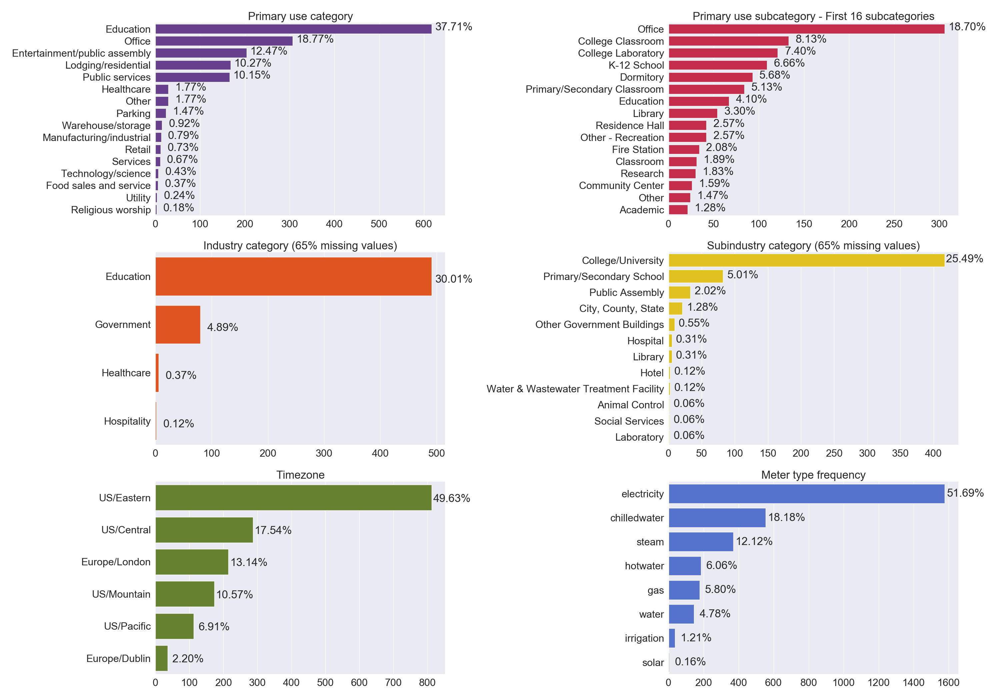
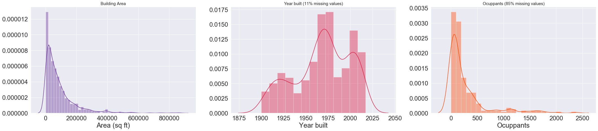

<!-- A repository of whole building electrical meters from non-residential buildings
============================== -->


- Does your data science technique actually scale across hundreds of buildings?
-  Is it actually faster or more accurate?

<div align="justify">These are questions that researchers should ask when developing data-driven methods. Building performance prediction, classification, and clustering algorithms are becoming an essential part of analysis for anomaly detection, control optimization, and demand response. But how do we actually compare, each individual technique against previously created methods?<br>
<br>
The time-series data mining community identifed this problem as early as 2003: “Much of this work has very little utility because the contribution made”...“offer an amount of improvement that would have been completely dwarfed by the variance that would have been observed by testing on many real world datasets, or the variance that would have been observed by changing minor (unstated) implementation details.” <a href="https://link.springer.com/article/10.1023/A:1024988512476">(Keogh and Kasetty, 2003)</a>.<br>
<br>
<a href="http://www.cs.ucr.edu/~eamonn/time_series_data/">They created the time-series data benchmarking set</a>. This data set enables testing of new techniques on an assortment of real world data sets. For commerical buildings data, we are doing the same!</div>

# The need for Benchmarking Data Set for Non-residential Building Data Analytics
<div align="justify">Most of the existing building performance data science studies rely on each individual researcher creating their own methods, finding a case study data set and determining efficacy on their own. Not surprisingly, most of those researcher find positive, yet questionably meaningful results.</div>


<div align="justify">Using a large, consistent benchmark data set from hundreds (or thousands) of buildings, a researcher can determine how well their methods actually perform across a heterogeneous data set. If multiple researcher use the same data set, then there can be meaningful comparisons of accuracy, speed and ease-of-use.</div>


# Building Data Genome 2.0 Data-Set
## Data-set description
<div align="justify">It is an open data set from 1636 non-residential buildings that includes hourly whole building data for two year, from different kind of meters: electricity, chilledwater, steam, hotwater, gas, water, irrigation and solar. Each of the buildings has metadata such as area, weather, and primary use type. This data set can be used to benchmark various statistical learning algorithms and other data science techniques. It can also be used simply as a teaching or learning tool to practice dealing with measured performance data from large numbers of non-residential buildings. The charts below illustrate the breakdown of the buildings according to primary use category and subcategory, industry and subindustry, timezon and meyer type.</div><br>




## Getting Started
We recommend you download the [Anaconda Python Distribution](https://www.continuum.io/downloads) and use Jupyter to get an understanding of the data.
- Raw temporal meters data are found in `/data/meters/raw`
- Raw metadata is found in `data/metadata/`

Example notebooks are found in `/notebooks/` -- a few good overview examples:
- [Exploratory Data Analysis of metadata](notebooks/01_EDA-metadata.ipynb)
- [Exploratory Data Analysis of weather](notebooks/02_EDA-weather.ipynb)

## Citation of BDG 2.0 Data-Set
* (publication)
* (ResearchGate)
* (Bibtex)

# Publications or Projects that use BDG 2.0 data-set
Please update this list if you add notebooks or R-Markdown files to the ``notebook`` folder. Naming convention is a number (for ordering), the creator's initials, and a short `-` delimited description, e.g. `1.0-jqp-initial-data-exploration`.

- (publication here)

## Repository structure
```
building-data-genome-project-2
├─ README.md			<- BDG 2.0 README for developers using this data-set
└─ data
|	├─ metadata		<- buildings metadata
|	├─ weather		 <-  weather data
|	└─ meters 
|		├─ raw		 <- all meter reading datasets, one file for each kind of meter
|		└─ processed   <- all meters joint in one dataset: hourly and daily
├─ notebooks			<- Jupyter notebooks
└─ figures			  <- figures created during exploration of BDG 2.0
```


