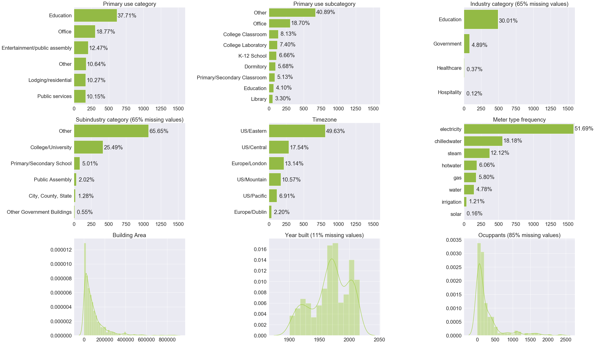

[](https://zenodo.org/badge/latestdoi/247690451)

# The Building Data Genome 2 (BDG2) Data-Set
## Data-set description
BDG2 is an open data set made up of 3,053 energy meters from 1,636 buildings. The time range of the times-series data is the two full years (2016 and 2017) and the frequency is hourly measurements of electricity, heating and cooling water, steam, and irrigation meters. A subset of the data was used in the [Great Energy Predictor III (GEPIII) competition hosted by the ASHRAE organization in late 2019](https://www.kaggle.com/c/ashrae-energy-prediction). A full overview of the GEPIII competition can be [found in a Science and Technology for the Built Environment Journal](https://www.tandfonline.com/doi/full/10.1080/23744731.2020.1795514) - [Preprint found on arXiv](https://arxiv.org/abs/2007.06933)

The GEPIII sub-set includes hourly data from 2,380 meters from 1,449 buildings that were used in a machine learning competition for long-term prediction with an application to measurement and verification in the building energy analysis domain. This data set can be used to benchmark various statistical learning algorithms and other data science techniques. It can also be used simply as a teaching or learning tool to practice dealing with measured performance data from large numbers of non-residential buildings. The charts below illustrate the breakdown of the buildings according to primary use category and subcategory, industry and subindustry, timezone and meter type.<br>



## Getting Started
We recommend you download the [Anaconda Python Distribution](https://www.continuum.io/downloads) and use Jupyter to get an understanding of the data.
- Temporal meters data are found in `/data/meters/`
- Metadata is found in `data/metadata/`
- To join all meters raw data into one dataset follow [this](/notebooks/00_All-meters-dataset.ipynb) notebook

Example notebooks are found in `/notebooks/` -- a few good overview examples:
- [Exploratory Data Analysis of metadata](notebooks/01_EDA-metadata.ipynb)
- [Exploratory Data Analysis of weather](notebooks/02_EDA-weather.ipynb)
- [Exploratory Data Analysis of meter reading](notebooks/03_EDA-meter-reading.ipynb)

## Detailed Documentation
The detailed documentation of how this data set was created can be found in the [repository's wiki](https://github.com/buds-lab/building-data-genome-project-2/wiki) and in the following publication:

### Citation of BDG2 Data-Set
* [Nature Scientific Data (open access)](https://www.nature.com/articles/s41597-020-00712-x)

Miller, C., Kathirgamanathan, A., Picchetti, B. et al. The Building Data Genome Project 2, energy meter data from the ASHRAE Great Energy Predictor III competition. Sci Data 7, 368 (2020). https://doi.org/10.1038/s41597-020-00712-x

```


@ARTICLE{Miller2020-yc,
  title     = "The Building Data Genome Project 2, energy meter data from the
               {ASHRAE} Great Energy Predictor {III} competition",
  author    = "Miller, Clayton and Kathirgamanathan, Anjukan and Picchetti,
               Bianca and Arjunan, Pandarasamy and Park, June Young and Nagy,
               Zoltan and Raftery, Paul and Hobson, Brodie W and Shi, Zixiao
               and Meggers, Forrest",
  abstract  = "This paper describes an open data set of 3,053 energy meters
               from 1,636 non-residential buildings with a range of two full
               years (2016 and 2017) at an hourly frequency (17,544
               measurements per meter resulting in approximately 53.6 million
               measurements). These meters were collected from 19 sites across
               North America and Europe, with one or more meters per building
               measuring whole building electrical, heating and cooling water,
               steam, and solar energy as well as water and irrigation meters.
               Part of these data was used in the Great Energy Predictor III
               (GEPIII) competition hosted by the American Society of Heating,
               Refrigeration, and Air-Conditioning Engineers (ASHRAE) in
               October-December 2019. GEPIII was a machine learning competition
               for long-term prediction with an application to measurement and
               verification. This paper describes the process of data
               collection, cleaning, and convergence of time-series meter data,
               the meta-data about the buildings, and complementary weather
               data. This data set can be used for further prediction
               benchmarking and prototyping as well as anomaly detection,
               energy analysis, and building type classification.
               Machine-accessible metadata file describing the reported data:
               https://doi.org/10.6084/m9.figshare.13033847",
  journal   = "Scientific Data",
  publisher = "Nature Publishing Group",
  volume    =  7,
  pages     = "368",
  month     =  oct,
  year      =  2020,
  language  = "en"
}


```

### Preprints
* [arXiv](https://arxiv.org/abs/2006.02273)
* [ResearchGate](https://www.researchgate.net/publication/341895125_The_Building_Data_Genome_Project_2_Hourly_energy_meter_data_from_the_ASHRAE_Great_Energy_Predictor_III_competition)

# Publications or Projects that use BDG2 data-set
Please update this list if you add notebooks or R-Markdown files to the ``notebook`` folder. Naming convention is a number (for ordering), the creator's initials, and a short `-` delimited description, e.g. `1.0-jqp-initial-data-exploration`.

- (publication here)

## Repository structure
```
building-data-genome-project-2
├─ README.md              <- BDG2 README for developers using this data-set
└─ data
|   ├─metadata            <- buildings metadata
|   ├─ weather            <- weather data
|   └─ meters
|       └─ raw            <- all meter reading datasets
|       └─ cleaned        <- cleaned meter data based on several filtering steps
|       └─ kaggle         <- the 2017 meter data that aligns with the Kaggle competition
├─ notebooks              <- Jupyter notebooks, named after the naming convention
└─ figures                <- figures created during exploration of BDG 2.0 Data-set
```


